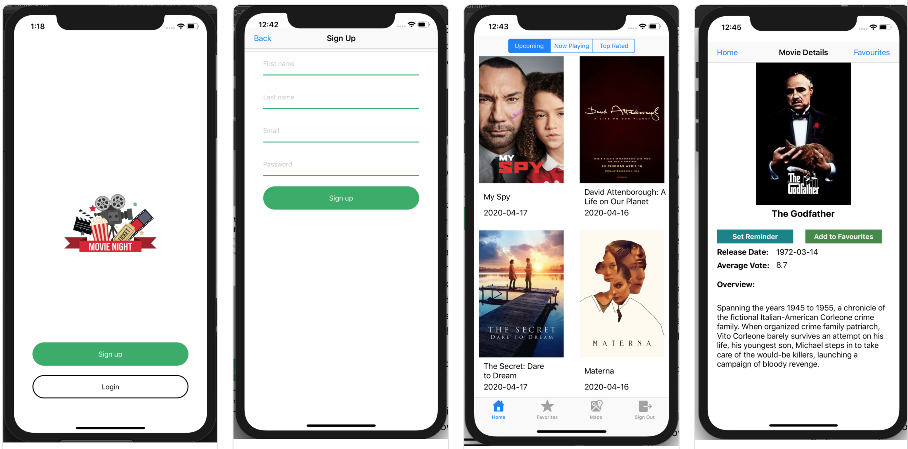
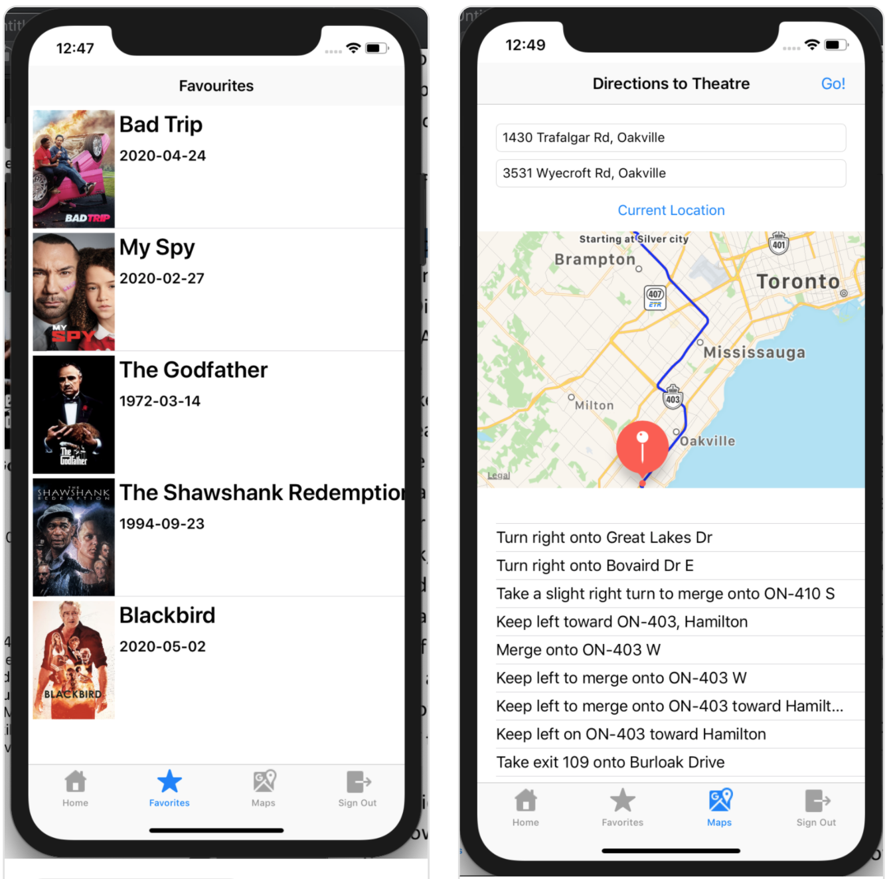

# iOS-Movie-Night
This was my final group project for iOS Mobile Application Development. It was a team project alongside Scott, Andrei, and Afsar.

Programming Language: Swift
Development Environment: Xcode 10.3, deployment target is minimum iOS 12.4, iPhone XR Simulator

Purpose: The purpose of our app is to help users plan their movie night by discovering movies that are currently playing in theatres, soon to be in theatres, and highest rated movies of all. Users can view movie details and summary, save movies to their Favourites list and set date reminder notification for a movie's theatre release dates. The app provides a Map and Directions feature, and allows user to post discussion comments. The app allows users to register for an account and securely authenticate user logins with Firebase.

Result: Our team received a project grade of 88%.
    
## Screenshots:

- Screen 1 and 2: For signing up and registering we used Firebase real-time database. 
- Screen 3: Browse movies by 3 categories, and navigate app using TabBar Navigation below.
- Screen 4: View movie information, pressing "Add to Favorite" saves selected movie to SQLite3 database, pressing "Set Reminder" schedules a local notification according the movie release date

- Screen 5: Displays registered user's favourite movies from SQLite3, Swipe right to Delete movie from Favourites
- Screen 6: Use MapViewKit and CoreLocation to draw the directions and provide directions step-by-step

## Features I implemented were:

  - Movie Poster Screen 
    - Make HTTP Request to The Movie Database API (themoviedb.org) to fetch movie details from themoviedb.org server
    - Service class to Parse JSON Response to any array of model Movie struct
    - Display Movies in Collection View updated by Segmented Control for Upcoming, Now Playing, Top Rated movie categories
    
  - Movie Details Screen:
    - Title, Release Date, Vote Rating Average
    - Add to Favorites - Insert user's favourite movie id to SQLITE3 internal database
    - Set Reminder - Schedule local push notifications set to movie theatre release date using UserNotification Framework
    
  - Favourites Screen:
    - Read/Delete movies from SQLITE3 internal database
    - Display favourite movies in a Table View
    - Swipe Right on any movie row to Delete
    
  - Navigation:
    - Navigation Controller and TabBar Controller
    
  - Integration:
    - Integrate and merge together all the team members storyboards and View Controllers

